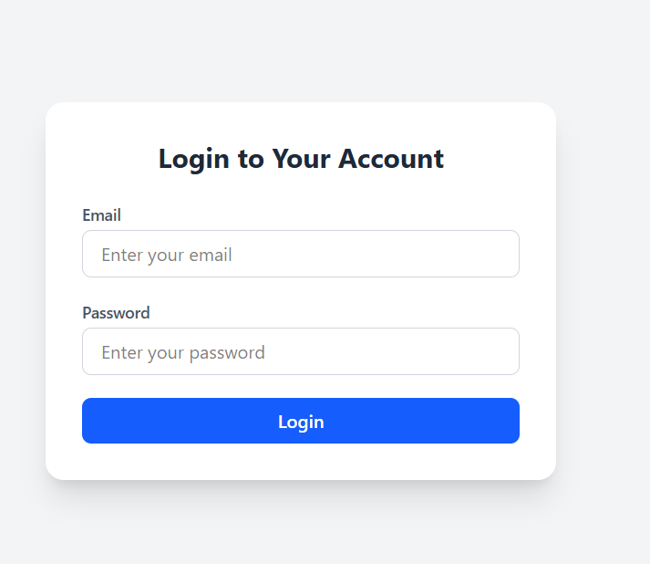
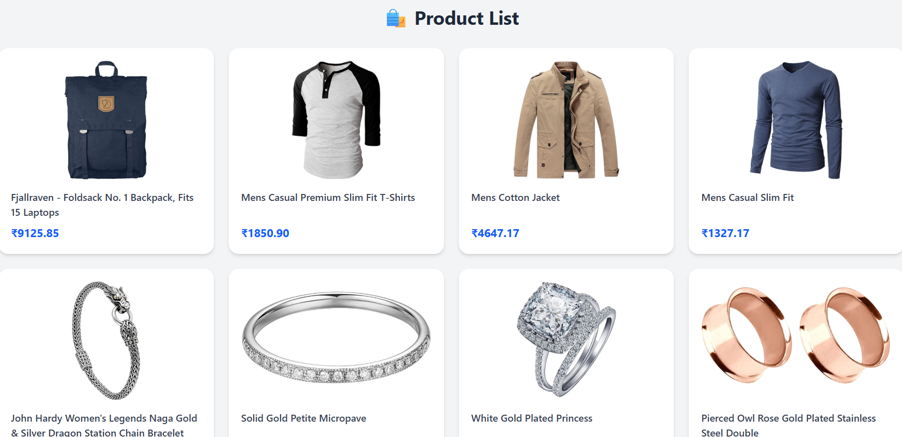
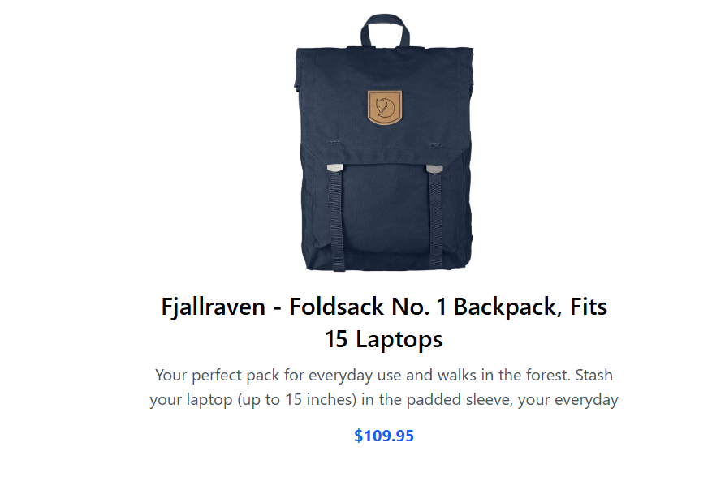

# MERN App

A simple full-stack project built using **React (frontend)** and **Node.js + Express (backend)**.  
The app connects with the [Fake Store API](https://fakestoreapi.com/) and includes mock login, product listing, and product detail pages.

---

## Setup

### Backend
```bash
cd backend
npm install
npm run dev

Runs at http://localhost:5000

###Frontend
cd frontend
npm install
npm run dev

Runs at http://localhost:5173

Login using:
Email: demo@gmail.com
Password: '123456'

Tech Stack

Node.js + Express
React + Vite
Fake Store API

Screenshots




Video:https://www.loom.com/share/dae32515b15a468badb0eff2753736a6